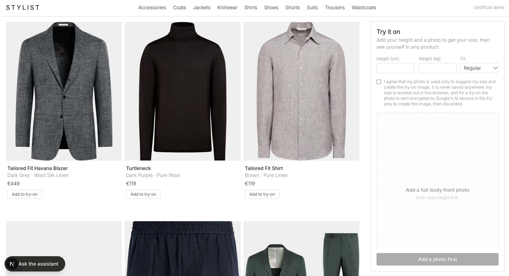
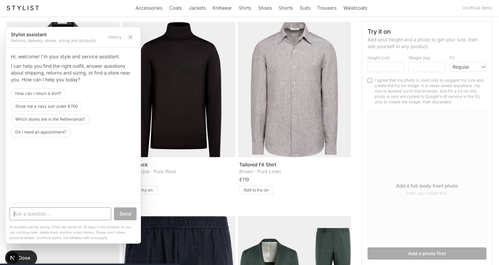
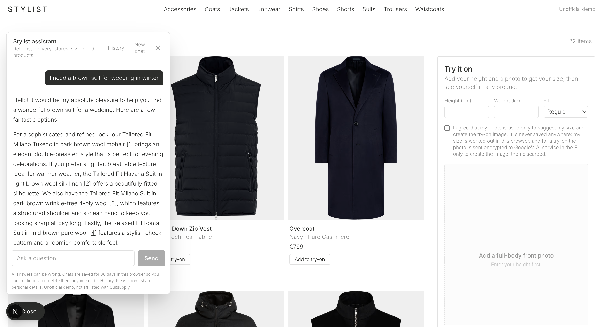
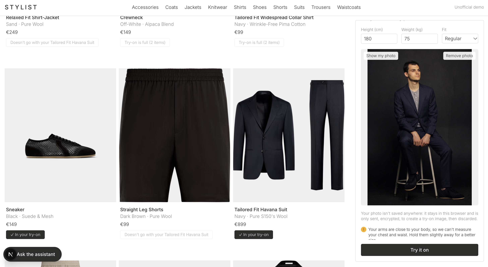
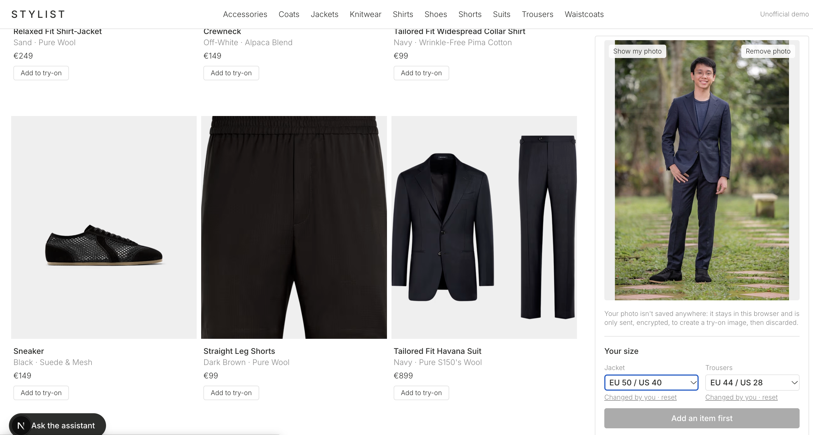
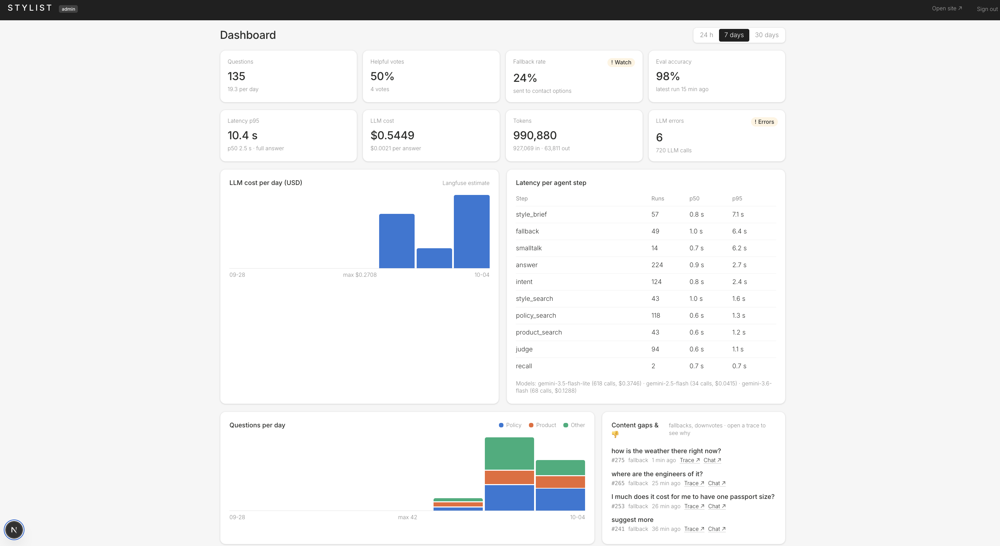
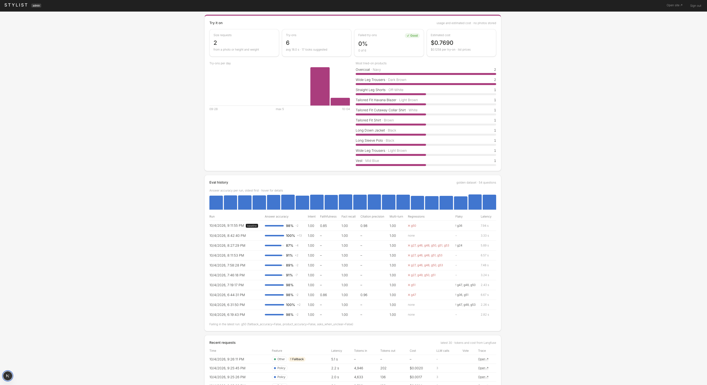

# AI Stylist Prototype

**What if every customer had their own customer service agent, personal stylist, sales assistant and fitting room,
open 24/7?**

This prototype brings all four to an online store: an AI shopping assistant and virtual fitting room for a menswear store, built only on Suitsupply's public website.
Customers can ask about delivery, returns or stores, find products, get a complete outfit for an occasion, and see
how clothes look on them from a single photo, with a size recommendation.

Every answer is grounded in the store's own pages and catalog, cites its sources, and is checked by a second model
before it is sent. When the assistant can't answer, it says why and points to customer service.


## Demo

<video src="docs/images/demo.mp4" controls width="100%"></video>

[Watch the demo video](docs/images/demo.mp4)

## Features

### Catalog

Browse the products by section, with prices and colours. Clicking a product opens it on suitsupply.com.



### Service assistant

Answers questions about shipping, returns, payments, alterations, services and stores from the customer service
pages, with numbered citations to the source pages. Typos and other languages are understood, and the answer comes
back in the customer's language. Conversations are kept for 30 days and can be deleted at any time.




### Style advisor

Puts together a complete outfit for an occasion (wedding, business, black tie, resort, clubbing) or around clothes
the customer already owns. It asks up to two questions when it's missing something important, such as the season
or the dress code, remembers the details through the conversation and updates only what changes. Suggestions follow
Suitsupply's own occasion guides and stay within the customer's budget.



### Try it on

Upload a photo and see yourself wearing up to two items, for example a shirt under a jacket. Outer layers are added
over what's already on, so the shirt stays visible. "Complete the look" suggests matching items. The photo is
never stored.



### Size advice

Recommends a jacket and trouser size, including short and long lengths, from body measurements taken from the photo
in the browser, the customer's height and weight, and their preferred fit. Notes cover sleeve length, hemming and
shoulders.



## Ops

### Evaluation

A golden dataset of 54 hand-written questions covers policy and store questions, product searches, style requests,
small talk, multi-turn follow-ups and questions that must go to customer service.

```bash
python eval/run.py                  # all questions, compared with the baseline
python eval/run.py --only g04,g23   # a few questions
python eval/run.py --judge          # also faithfulness, citation precision and relevance
python eval/run.py --save-baseline  # make this run the new baseline
```

- **Deterministic checks per question:** right intent and route, contact fallback only when expected, expected
  page retrieved and cited, every citation valid, expected facts present, product cards matching the requested
  section, colour and price, the stylist asking questions exactly when the request is incomplete, and no repeated
  greetings mid-conversation.
- **Gate:** a run passes only when every question passes. LLM answers vary between runs, so a failed question is
  tried twice; passing on the retry counts but is reported as flaky.
- **Baseline:** each run is compared with `eval/baseline.json` and lists regressions per question.
- **LLM-graded scores** (optional): a separate, larger Gemini model grades faithfulness to the sources, citation
  precision and answer relevance.
- Every full run is saved to the database and shown in the admin dashboard.

### In production

- **Answer check:** a judge step checks every draft before it is sent: does it answer the question, is it grounded
  in the sources, are the citations right? A rejected draft is rewritten once with feedback; if it fails again,
  the customer gets a friendly fallback with contact options.
- **Tracing:** every step of every answer is traced in Langfuse (inputs, sources, drafts, verdicts, tokens, cost
  and latency). A conversation is a Langfuse session, and eval traces are kept apart from real usage.
- **Admin dashboard:** questions per day per feature, fallbacks and thumbs-down answers with links to their traces,
  latency per agent step, LLM cost and tokens, recent requests, try-on usage and cost, eval history and system
  status.
- **Limits and retention:** a daily try-on limit per visitor, chats deleted after 30 days by a scheduled job, and
  no photos stored.






## Stack

| Layer | Tools |
|---|---|
| Web | Next.js 16, React 19, Tailwind CSS 4, MediaPipe Pose (in the browser) |
| API | Python, FastAPI, LangGraph, LangChain |
| Models | Gemini 3.5 Flash-Lite (assistant and judge), Gemini 2.5 Flash-Lite (conversation memory), Gemini 3.6 Flash (eval grader), all on Vertex AI |
| Try-on | Vertex AI Virtual Try-On, Gemini 3.1 Flash Image for outer layers |
| Retrieval | gemini-embedding-001, Postgres 17 with pgvector, hybrid vector and full-text search merged with reciprocal rank fusion |
| Data | Python crawler (requests, Beautiful Soup, markdownify) that respects robots.txt |
| Observability | Langfuse, admin dashboard |
| Cloud | Google Cloud: Cloud Run, Cloud SQL, Cloud Storage, Secret Manager, Cloud Scheduler, Artifact Registry |
| Delivery | Terraform, GitHub Actions with Workload Identity Federation (no service account keys) |

All AI processing stays in EU regions (europe-west4 and the Vertex AI `eu` multi-region).

## Google Cloud and Vertex AI

The whole project runs on one Google Cloud project, defined in Terraform (`infra/`) with its state in a Cloud
Storage bucket.

### Vertex AI

Every model is called through Vertex AI with the service's own identity: no API keys in the code or in secrets.

| Use | Model | Region | Notes |
|---|---|---|---|
| Assistant: intent, answers, style advisor, judge | Gemini 3.5 Flash-Lite | `eu` multi-region | Structured outputs (Pydantic) for intent, the stylist's details and the judge's verdict |
| Conversation memory | Gemini 2.5 Flash-Lite | europe-west4 | Summarises long chats after the reply is sent, at temperature 0 |
| Embeddings | gemini-embedding-001, 768 dimensions | europe-west4 | `RETRIEVAL_DOCUMENT` for pages and products, `RETRIEVAL_QUERY` for questions; retries with backoff on 429 and 5xx |
| Virtual try-on | virtual-try-on-001 | europe-west4 | Dresses the photo in the product image |
| Outer layers | Gemini 3.1 Flash Image | `eu` multi-region | Puts a jacket or coat over what's already on, keeping the shirt visible |
| Complete the look | Gemini 3.5 Flash-Lite | `eu` multi-region | Picks 2–3 matching catalog items |
| Eval grader | Gemini 3.6 Flash | `eu` multi-region | A larger model than the one it grades |

Gemini 3.x models aren't offered in single EU regions, so they use the `eu` multi-region; everything else stays in
the Netherlands (europe-west4). The `global` endpoint is never used, so no data leaves the EU.

### Google Cloud services

- **Cloud Run** runs two services in europe-west4, each with its own service account and least-privilege roles:
  - `web` (Next.js) is public.
  - `api` (FastAPI) is private: only the web service and the scheduler may invoke it. The web service calls it with
    an identity token from the metadata server.
  - Both scale to zero and are capped at two instances.
- **Cloud SQL** (Postgres 17 with pgvector) holds the knowledge chunks, product embeddings, chat history, usage
  events and eval runs. The api connects through the Cloud SQL socket mounted into Cloud Run; locally, through the
  Cloud SQL Auth Proxy.
- **Cloud Storage** holds the crawled catalog, mounted into the api as a read-only volume, plus the Terraform state.
- **Secret Manager** stores the database password, the admin password and the Langfuse keys. Cloud Run reads them
  as environment variables; nothing secret is in the repository.
- **Cloud Scheduler** calls the api every night with an OIDC token to delete chats older than 30 days.
- **Artifact Registry** stores the Docker images.
- **Workload Identity Federation** lets GitHub Actions deploy without a service account key. Only pushes to `main`
  of this repository can get a token, and the deployer can only push images and deploy Cloud Run.

### Deployment

A push to `main` that touches `api/` or `web/` builds both services with Docker, pushes the images to Artifact
Registry and deploys new Cloud Run revisions. Infrastructure changes go through `terraform plan` and `terraform apply`.

## Run it locally

**You need:** Python 3.13, Node.js 20+, the gcloud CLI, a Google Cloud project with the Vertex AI API enabled,
and Postgres 17 with pgvector.

**1. Google Cloud login and database**

```bash
gcloud auth application-default login
export GOOGLE_CLOUD_PROJECT=your-project-id

# Postgres with pgvector in Docker (or Cloud SQL through the Cloud SQL Auth Proxy)
docker run -d --name stylist-db -p 5433:5432 -e POSTGRES_PASSWORD=dev -e POSTGRES_DB=stylist pgvector/pgvector:pg17
export PGHOST=localhost PGPORT=5433 PGUSER=postgres PGPASSWORD=dev PGDATABASE=stylist
```

**2. Collect and embed the public data**

```bash
python -m venv .venv && source .venv/bin/activate
pip install -r ingest/requirements.txt -r api/requirements.txt

python ingest/crawl.py       # product sample (slow on purpose, a few seconds per page)
python ingest/pages.py       # customer service pages and stores
python ingest/occasions.py   # occasion guides and their products
python ingest/embed.py       # chunks, embeddings and products into Postgres
```

**3. API**

```bash
cd api
cp .env.example .env         # optional: Langfuse keys for tracing
uvicorn main:app --reload --env-file .env
```

**4. Web**

```bash
cd web
npm install
API_URL=http://localhost:8000 ADMIN_PASSWORD=choose-one npm run dev
```

Open http://localhost:3000, and http://localhost:3000/admin for the dashboard.

**5. Evals** (with the same environment as the API)

```bash
python eval/run.py
```

## Docs

- [Assumptions](docs/assumptions.md)
- [Agent graph](docs/diagrams/agent-graph.md)
