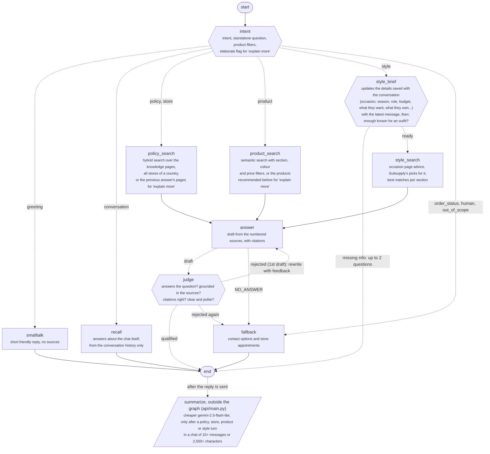

# Service assistant graph

The LangGraph agent in `api/agent.py`. Dashed arrows are conditional edges.
Every node gets the conversation so far: a summary plus the last 10 messages.
Answers are checked by the judge before they're sent, so they arrive in one piece instead of streaming.
The summary is not a graph node: the api updates it after the reply, when it's worth it.

| Intent | Route (eval, dashboard, events table) | Next node |
|---|---|---|
| greeting | other | smalltalk |
| policy | policy | policy_search |
| store | policy | policy_search |
| product | product | product_search |
| style | style | style_brief |
| order_status | other | fallback |
| human | other | fallback |
| conversation | other | recall |
| out_of_scope | other | fallback |
